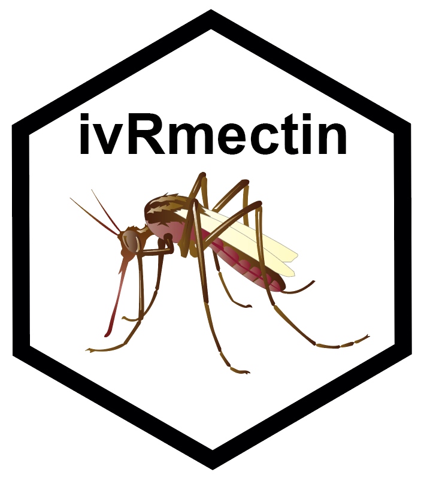

<!-- README.md is generated from README.Rmd. Please edit that file -->

# ivRmectin 

<!-- badges: start -->

<!-- badges: end -->

*ivRmectin* enables users to simulate models of malaria transmission
with an explicit focus on exploring the impact of different
endectocide-based interventions such as ivermectin. This model has been
previously published and more information can be found in *Slater et
al., 2014, Journal of Infectious Diseases*
(<https://academic.oup.com/jid/article/210/12/1972/2908666>) and *Slater
et al., 2020, Lancet Infectious Diseases*
(<https://www.thelancet.com/journals/laninf/article/PIIS1473-3099(19)30633-4/fulltext>).

## IMPORTANT NOTES

:warning: This code is released with no support and is not currently
finished. Users outside Imperial College looking to run models in this
repository should contact one of the package authors first to discuss
requirements.

:warning: This model is in active development and so parameter names and
behaviours, as well as output file formats, will change without notice.

# Copyright and Licensing

The source code for ivRmectin is licensed under the GPLv3, see LICENSE
for more details. The lead developers are Hannah Slater and Charlie
Whittaker.
